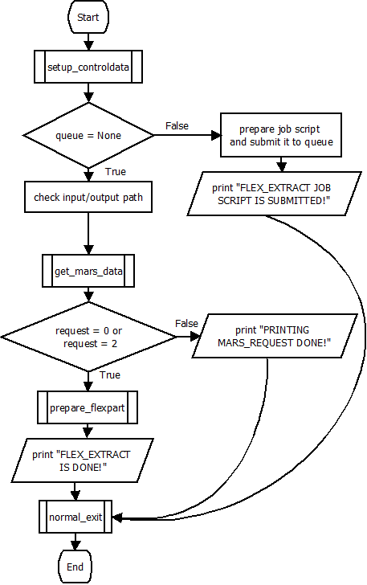
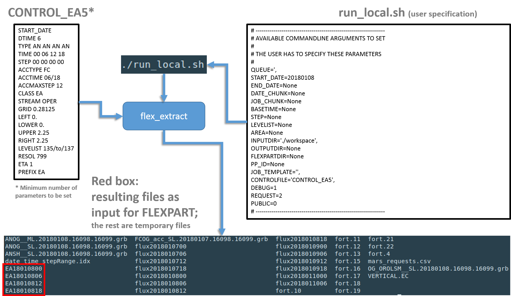

************
Program flow
************

General program flow
====================

The following flow diagram shows the general steps performed by ``flex_extract``. 
    
.. _ref-fig-submit:

    
    Overview of the call of the``submit.py`` Python script and raw sequence of work steps in ``flex_extract``.

    
The ``submit.py`` Python script is called by the shell script ``run.sh`` or ``run_local.sh`` and accomplishes the following steps: 

    1. Setup of control data:
        Command-line and ``CONTROL``-file parameters are read, as well as (optionally) the ECMWF user credentials. Depending the :doc:`app_modes`, a job script might be prepared which is then sent to the ECMWF queue. 
    2. Retrieval of data from MARS:
        MARS requests are created either on the local machine or on the ECMWF server and then submitted which retrieve the data and store them in GRIB files. If the parameter ``REQUEST`` was set ``1``, the data are not retrieved and instead a file ``mars_requests.csv`` is created, which contains a list of the MARS requests and their settings. If ``REQEST`` is set to ``2``, the csv file is created in addition to retrieving the data. The requests are created in an optimised way by splitting with respect to time, jobs  and parameters.   
    3. Post-processing of data to create final ``FLEXPART`` input files:
        After all data have been retrieved, flux fields are disaggregated (`see here <../disagg.html>`_ ) and the vertical velocity is calculated (`see here <../vertco.html>`_) by the Fortran program ``calc_etadot``. Finally, the GRIB fields are merged into a single grib file per time step containing all the fields for ``FLEXPART``. Since model-level fields are typically in *GRIB2* format, whereas surface-level fields are still in *GRIB1* format, they will be converted into GRIB2 if parameter ``FORMAT`` is set to *GRIB2*. Please note, however, that older versions of FLEXPART may have difficulties to read these *GRIB2* files since some parameter IDs have been change in *GRIB2*. If the retrieval is executed remotely at ECMWF, the resulting files will be sent to the local gateway server via the ``ECtrans`` utility if the parameter ``ECTRANS`` is set to ``1`` and the parameters ``GATEWAY``, ``DESTINATION`` have been set properly during installation. The status of the transfer can be checked with the command ``ecaccess-ectrans-list`` (on the local gateway server). If the script is executed locally, the progress of the script can be followed with the usual Linux tools.

Workflows of different application modes
========================================

The following diagrams show how different the program flow is for the different :doc:`app_modes`:  

+-------------------------------------------------+------------------------------------------------+
| .. figure:: ../../_files/mode_remote.png        | .. figure:: ../../_files/mode_gateway.png      |
+-------------------------------------------------+------------------------------------------------+   

+-------------------------------------------------+------------------------------------------------+
| .. figure:: ../../_files/mode_local_member.png  | .. figure:: ../../_files/mode_local_public.png |
+-------------------------------------------------+------------------------------------------------+   

Example application setting for a local member user
===================================================

.. toctree::
    :hidden:
    :maxdepth: 2
